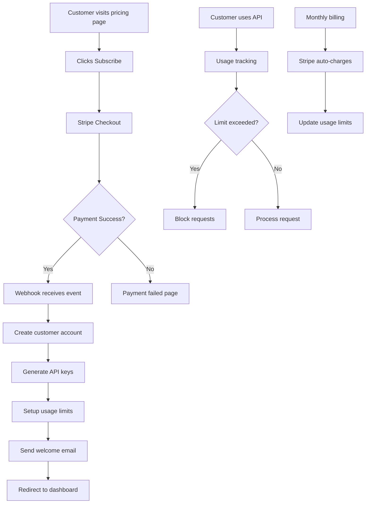

# 🚀 EasyOTPAuth + Stripe Integration Guide

A comprehensive guide to monetize your EasyOTPAuth system with Stripe payments, automated product delivery, and customer management.

---

## 📋 Table of Contents

1. [Stripe Integration Strategy](#stripe-integration-strategy)
2. [Product Delivery Methods](#product-delivery-methods)
3. [Architecture Overview](#architecture-overview)
4. [Implementation Steps](#implementation-steps)
5. [Testing Strategy](#testing-strategy)
6. [Deployment Checklist](#deployment-checklist)

---

## 🎯 Stripe Integration Strategy

### **Pricing Tiers Implementation**

Based on your current pricing page, here's how to structure Stripe products:

```javascript
// Stripe Product Configuration
const STRIPE_PRODUCTS = {
  starter: {
    priceId: 'price_starter_monthly', // From Stripe Dashboard
    name: 'Starter Plan',
    price: 2900, // $29.00 in cents
    features: [
      'Up to 1,000 authentications',
      'Email support',
      'Basic analytics',
      'Standard integrations'
    ],
    limits: {
      maxAuthentications: 1000,
      supportLevel: 'email'
    }
  },
  professional: {
    priceId: 'price_professional_monthly',
    name: 'Professional Plan', 
    price: 14900, // $149.00 in cents
    features: [
      'Up to 10,000 authentications',
      'Priority support',
      'Advanced analytics',
      'Custom branding',
      '99.9% uptime SLA'
    ],
    limits: {
      maxAuthentications: 10000,
      supportLevel: 'priority',
      customBranding: true
    }
  },
  enterprise: {
    priceId: 'price_enterprise_custom',
    name: 'Enterprise Plan',
    price: null, // Custom pricing
    features: [
      'Unlimited authentications',
      'Dedicated support',
      'Custom integrations',
      'On-premise deployment',
      'White-label solution'
    ],
    limits: {
      maxAuthentications: -1, // Unlimited
      supportLevel: 'dedicated',
      customBranding: true,
      onPremise: true
    }
  }
};
```

### **Subscription vs One-Time Payment Options**

```javascript
// Payment Models
const PAYMENT_MODELS = {
  // Monthly Subscriptions (Recommended)
  subscription: {
    billing: 'monthly',
    trial: 14, // 14-day free trial
    cancellation: 'immediate', // or 'end_of_period'
  },
  
  // Annual Subscriptions (20% discount)
  annual: {
    billing: 'yearly',
    discount: 0.2,
    trial: 30, // 30-day free trial for annual
  },
  
  // One-time Setup Fee + Monthly
  hybrid: {
    setupFee: 9900, // $99 one-time
    monthly: true,
    trial: 7
  }
};
```

---

## 📦 Product Delivery Methods

### **Method 1: Instant API Access (Recommended)**

**What Gets Delivered:**
- API keys with usage limits
- Dashboard access with plan features
- Email with setup instructions
- Webhook endpoints for their domain

**Implementation:**
```javascript
// After successful payment
async function deliverProduct(customerId, planType) {
  // 1. Create API keys
  const apiKey = await generateAPIKey(customerId, planType);
  
  // 2. Setup usage limits
  await setUsageLimits(apiKey, STRIPE_PRODUCTS[planType].limits);
  
  // 3. Create customer dashboard
  const dashboardUrl = await createCustomerDashboard(customerId);
  
  // 4. Send welcome email with credentials
  await sendWelcomeEmail(customerId, {
    apiKey,
    dashboardUrl,
    setupGuide: `https://docs.easyotpauth.com/quickstart`,
    supportEmail: 'support@easyotpauth.com'
  });
  
  // 5. Enable features based on plan
  await enablePlanFeatures(customerId, planType);
}
```

### **Method 2: White-Label Instance Deployment**

**What Gets Delivered:**
- Dedicated subdomain (e.g., `customer.easyotpauth.com`)
- Custom branding applied
- Separate database/Redis instance
- SSL certificates
- Admin panel access

**Implementation:**
```javascript
// Automated deployment pipeline
async function deployWhiteLabelInstance(customerId, branding) {
  // 1. Create subdomain
  const subdomain = await createSubdomain(customerId);
  
  // 2. Deploy instance with custom branding
  await deployToVercel({
    domain: subdomain,
    env: {
      BRANDING_NAME: branding.companyName,
      BRANDING_LOGO: branding.logoUrl,
      BRANDING_COLORS: branding.colors,
      CUSTOMER_ID: customerId
    }
  });
  
  // 3. Setup SSL and DNS
  await setupSSL(subdomain);
  
  // 4. Create admin access
  const adminCredentials = await createAdminUser(customerId);
  
  return { subdomain, adminCredentials };
}
```

### **Method 3: Self-Hosted Package**

**What Gets Delivered:**
- Docker containers
- Environment configuration
- Database setup scripts
- Documentation
- License key

**Implementation:**
```javascript
// Package generation
async function generateSelfHostedPackage(customerId, planType) {
  const licenseKey = await generateLicenseKey(customerId, planType);
  
  // Create deployment package
  const package = {
    dockerCompose: generateDockerCompose(licenseKey),
    envTemplate: generateEnvTemplate(),
    setupScript: generateSetupScript(),
    documentation: generateDocs(planType),
    licenseKey
  };
  
  // Upload to customer portal
  const downloadUrl = await uploadPackage(customerId, package);
  
  return downloadUrl;
}
```

---

## 🏗️ Architecture Overview



---

## 🛠️ Implementation Steps

### **Step 1: Stripe Setup**

```bash
# Install Stripe CLI and dependencies
npm install stripe
npm install -g stripe-cli

# Login to Stripe
stripe login

# Create products in Stripe Dashboard or via API
```

**Create Stripe Products:**
```javascript
// scripts/create-stripe-products.js
const stripe = require('stripe')(process.env.STRIPE_SECRET_KEY);

async function createProducts() {
  // Starter Plan
  const starterProduct = await stripe.products.create({
    name: 'EasyOTPAuth Starter',
    description: 'Perfect for small applications',
  });
  
  const starterPrice = await stripe.prices.create({
    product: starterProduct.id,
    unit_amount: 2900,
    currency: 'usd',
    recurring: { interval: 'month' },
  });
  
  // Professional Plan
  const proProduct = await stripe.products.create({
    name: 'EasyOTPAuth Professional',
    description: 'For growing businesses',
  });
  
  const proPrice = await stripe.prices.create({
    product: proProduct.id,
    unit_amount: 14900,
    currency: 'usd',
    recurring: { interval: 'month' },
  });
  
  console.log('Products created:', {
    starter: starterPrice.id,
    professional: proPrice.id
  });
}

createProducts();
```

### **Step 2: Payment Processing**

**Add to your existing API (api/index.js):**
```javascript
const stripe = require('stripe')(process.env.STRIPE_SECRET_KEY);

// Create checkout session
app.post('/api/create-checkout-session', async (req, res) => {
  try {
    const { priceId, customerEmail, planType } = req.body;
    
    const session = await stripe.checkout.sessions.create({
      payment_method_types: ['card'],
      customer_email: customerEmail,
      line_items: [{
        price: priceId,
        quantity: 1,
      }],
      mode: 'subscription',
      success_url: `${process.env.DOMAIN}/success?session_id={CHECKOUT_SESSION_ID}`,
      cancel_url: `${process.env.DOMAIN}/pricing`,
      metadata: {
        planType,
        customerEmail
      },
      subscription_data: {
        trial_period_days: 14, // 14-day free trial
      }
    });
    
    res.json({ url: session.url });
  } catch (error) {
    res.status(500).json({ error: error.message });
  }
});

// Handle webhooks
app.post('/api/stripe-webhook', express.raw({type: 'application/json'}), async (req, res) => {
  const sig = req.headers['stripe-signature'];
  let event;
  
  try {
    event = stripe.webhooks.constructEvent(req.body, sig, process.env.STRIPE_WEBHOOK_SECRET);
  } catch (err) {
    return res.status(400).send(`Webhook signature verification failed.`);
  }
  
  switch (event.type) {
    case 'checkout.session.completed':
      await handleSuccessfulPayment(event.data.object);
      break;
    case 'customer.subscription.deleted':
      await handleSubscriptionCancellation(event.data.object);
      break;
    case 'invoice.payment_succeeded':
      await handleSuccessfulRenewal(event.data.object);
      break;
    case 'invoice.payment_failed':
      await handleFailedPayment(event.data.object);
      break;
  }
  
  res.json({received: true});
});

// Handle successful payment
async function handleSuccessfulPayment(session) {
  const { customer, metadata } = session;
  const { planType, customerEmail } = metadata;
  
  // 1. Create customer record
  const customerId = await createCustomer({
    stripeCustomerId: customer,
    email: customerEmail,
    planType,
    status: 'active'
  });
  
  // 2. Generate API keys
  const apiKey = await generateAPIKey(customerId, planType);
  
  // 3. Setup usage limits
  await setUsageLimits(apiKey, STRIPE_PRODUCTS[planType].limits);
  
  // 4. Send welcome email
  await sendWelcomeEmail(customerEmail, {
    apiKey,
    planType,
    dashboardUrl: `${process.env.DOMAIN}/dashboard?key=${apiKey}`
  });
  
  logger.info(`New customer activated: ${customerId} on ${planType} plan`);
}
```

### **Step 3: Customer Management System**

**Database Schema:**
```sql
-- customers table
CREATE TABLE customers (
  id UUID PRIMARY KEY DEFAULT gen_random_uuid(),
  stripe_customer_id VARCHAR NOT NULL UNIQUE,
  email VARCHAR NOT NULL,
  plan_type VARCHAR NOT NULL,
  status VARCHAR DEFAULT 'active',
  api_key VARCHAR UNIQUE NOT NULL,
  usage_count INTEGER DEFAULT 0,
  usage_limit INTEGER NOT NULL,
  created_at TIMESTAMP DEFAULT NOW(),
  updated_at TIMESTAMP DEFAULT NOW()
);

-- usage_logs table  
CREATE TABLE usage_logs (
  id UUID PRIMARY KEY DEFAULT gen_random_uuid(),
  customer_id UUID REFERENCES customers(id),
  api_key VARCHAR NOT NULL,
  endpoint VARCHAR NOT NULL,
  ip_address INET,
  timestamp TIMESTAMP DEFAULT NOW(),
  success BOOLEAN DEFAULT true
);

-- feature_flags table
CREATE TABLE feature_flags (
  id UUID PRIMARY KEY DEFAULT gen_random_uuid(),
  customer_id UUID REFERENCES customers(id),
  feature_name VARCHAR NOT NULL,
  enabled BOOLEAN DEFAULT false,
  created_at TIMESTAMP DEFAULT NOW()
);
```

**Customer Dashboard API:**
```javascript
// Get customer dashboard data
app.get('/api/dashboard', authenticateAPIKey, async (req, res) => {
  const { customer } = req;
  
  const dashboardData = {
    customer: {
      email: customer.email,
      planType: customer.plan_type,
      status: customer.status
    },
    usage: {
      current: customer.usage_count,
      limit: customer.usage_limit,
      percentage: (customer.usage_count / customer.usage_limit) * 100
    },
    billing: await getStripeSubscription(customer.stripe_customer_id),
    features: await getCustomerFeatures(customer.id)
  };
  
  res.json(dashboardData);
});

// Usage tracking middleware
async function trackUsage(req, res, next) {
  const apiKey = req.headers['x-api-key'];
  
  if (!apiKey) {
    return res.status(401).json({ error: 'API key required' });
  }
  
  const customer = await getCustomerByAPIKey(apiKey);
  
  if (!customer) {
    return res.status(401).json({ error: 'Invalid API key' });
  }
  
  if (customer.usage_count >= customer.usage_limit) {
    return res.status(429).json({ 
      error: 'Usage limit exceeded',
      limit: customer.usage_limit,
      current: customer.usage_count
    });
  }
  
  // Log usage
  await logUsage(customer.id, apiKey, req.path, req.ip);
  
  // Increment usage counter
  await incrementUsage(customer.id);
  
  req.customer = customer;
  next();
}
```

### **Step 4: Frontend Integration**

**Update your pricing page buttons:**
```html
<!-- In your pricing section -->
<button 
  class="btn-primary w-full py-4" 
  onclick="subscribeToPlan('starter', 'price_starter_monthly')"
>
  Get Started
</button>

<button 
  class="btn-primary w-full py-4"
  onclick="subscribeToPlan('professional', 'price_professional_monthly')"
>
  Start Professional  
</button>

<script>
async function subscribeToPlan(planType, priceId) {
  const email = prompt('Enter your email address:');
  if (!email) return;
  
  try {
    const response = await fetch('/api/create-checkout-session', {
      method: 'POST',
      headers: { 'Content-Type': 'application/json' },
      body: JSON.stringify({
        priceId,
        customerEmail: email,
        planType
      })
    });
    
    const { url } = await response.json();
    window.location.href = url;
  } catch (error) {
    alert('Payment setup failed. Please try again.');
  }
}
</script>
```

**Customer Dashboard Page:**
```html
<!-- dashboard.html -->
<!DOCTYPE html>
<html>
<head>
    <title>EasyOTPAuth Dashboard</title>
</head>
<body class="bg-gray-50">
    <div class="max-w-6xl mx-auto px-6 py-8" id="dashboard">
        <h1 class="text-3xl font-bold mb-8">Your EasyOTPAuth Dashboard</h1>
        
        <!-- Usage Stats -->
        <div class="grid md:grid-cols-3 gap-6 mb-8">
            <div class="bg-white p-6 rounded-lg shadow">
                <h3 class="text-lg font-semibold mb-2">Usage This Month</h3>
                <div class="text-3xl font-bold text-blue-600" id="usage-count">-</div>
                <div class="text-sm text-gray-600" id="usage-limit">of - requests</div>
                <div class="w-full bg-gray-200 rounded-full h-2 mt-2">
                    <div class="bg-blue-600 h-2 rounded-full" id="usage-bar"></div>
                </div>
            </div>
            
            <div class="bg-white p-6 rounded-lg shadow">
                <h3 class="text-lg font-semibold mb-2">Current Plan</h3>
                <div class="text-3xl font-bold text-green-600" id="plan-type">-</div>
                <button class="text-sm text-blue-600 hover:underline mt-2">Upgrade Plan</button>
            </div>
            
            <div class="bg-white p-6 rounded-lg shadow">
                <h3 class="text-lg font-semibold mb-2">API Status</h3>
                <div class="text-3xl font-bold text-green-600">Active</div>
                <div class="text-sm text-gray-600">All systems operational</div>
            </div>
        </div>
        
        <!-- API Key Section -->
        <div class="bg-white p-6 rounded-lg shadow mb-8">
            <h3 class="text-lg font-semibold mb-4">API Configuration</h3>
            <div class="mb-4">
                <label class="block text-sm font-medium mb-2">Your API Key</label>
                <div class="flex gap-2">
                    <input 
                        type="password" 
                        id="api-key" 
                        class="flex-1 px-3 py-2 border rounded-lg"
                        readonly
                    >
                    <button onclick="toggleAPIKey()" class="px-4 py-2 bg-blue-600 text-white rounded-lg">
                        Show
                    </button>
                    <button onclick="copyAPIKey()" class="px-4 py-2 bg-gray-600 text-white rounded-lg">
                        Copy
                    </button>
                </div>
            </div>
            
            <div class="mb-4">
                <label class="block text-sm font-medium mb-2">API Endpoint</label>
                <code class="block px-3 py-2 bg-gray-100 rounded-lg">
                    https://your-domain.com/auth/
                </code>
            </div>
            
            <div class="mb-4">
                <h4 class="font-medium mb-2">Quick Start Example:</h4>
                <pre class="bg-gray-900 text-green-400 p-4 rounded-lg text-sm overflow-x-auto"><code>// Request OTP
curl -X POST https://your-domain.com/auth/request-code \\
  -H "X-API-Key: YOUR_API_KEY" \\
  -H "Content-Type: application/json" \\
  -d '{"email": "user@example.com"}'

// Verify OTP  
curl -X POST https://your-domain.com/auth/verify-code \\
  -H "X-API-Key: YOUR_API_KEY" \\
  -H "Content-Type: application/json" \\
  -d '{"email": "user@example.com", "code": "123456"}'</code></pre>
            </div>
        </div>
        
        <!-- Billing Section -->
        <div class="bg-white p-6 rounded-lg shadow">
            <h3 class="text-lg font-semibold mb-4">Billing & Subscription</h3>
            <div class="grid md:grid-cols-2 gap-6">
                <div>
                    <h4 class="font-medium mb-2">Next Billing Date</h4>
                    <div id="next-billing">Loading...</div>
                </div>
                <div>
                    <h4 class="font-medium mb-2">Billing Amount</h4>
                    <div id="billing-amount">Loading...</div>
                </div>
            </div>
            <div class="mt-4 flex gap-4">
                <button class="px-4 py-2 bg-blue-600 text-white rounded-lg">
                    Update Payment Method
                </button>
                <button class="px-4 py-2 border border-red-600 text-red-600 rounded-lg">
                    Cancel Subscription
                </button>
            </div>
        </div>
    </div>

    <script>
        // Load dashboard data
        async function loadDashboard() {
            const apiKey = new URLSearchParams(window.location.search).get('key');
            if (!apiKey) {
                alert('Invalid access. Please check your email for the dashboard link.');
                return;
            }
            
            try {
                const response = await fetch('/api/dashboard', {
                    headers: { 'X-API-Key': apiKey }
                });
                
                const data = await response.json();
                
                // Update UI
                document.getElementById('usage-count').textContent = data.usage.current;
                document.getElementById('usage-limit').textContent = `of ${data.usage.limit} requests`;
                document.getElementById('usage-bar').style.width = `${data.usage.percentage}%`;
                document.getElementById('plan-type').textContent = data.customer.planType;
                document.getElementById('api-key').value = apiKey;
                
                if (data.billing) {
                    document.getElementById('next-billing').textContent = 
                        new Date(data.billing.current_period_end * 1000).toLocaleDateString();
                    document.getElementById('billing-amount').textContent = 
                        `$${(data.billing.plan.amount / 100).toFixed(2)}`;
                }
                
            } catch (error) {
                console.error('Failed to load dashboard:', error);
            }
        }
        
        function toggleAPIKey() {
            const input = document.getElementById('api-key');
            const button = event.target;
            
            if (input.type === 'password') {
                input.type = 'text';
                button.textContent = 'Hide';
            } else {
                input.type = 'password';
                button.textContent = 'Show';
            }
        }
        
        function copyAPIKey() {
            const input = document.getElementById('api-key');
            input.select();
            document.execCommand('copy');
            
            const button = event.target;
            const originalText = button.textContent;
            button.textContent = 'Copied!';
            setTimeout(() => button.textContent = originalText, 2000);
        }
        
        // Load dashboard on page load
        loadDashboard();
    </script>
</body>
</html>
```

---

## 🧪 Testing Strategy

### **Pre-Deployment Testing**

**1. Stripe Test Mode:**
```bash
# Use Stripe test keys
STRIPE_PUBLISHABLE_KEY=pk_test_...
STRIPE_SECRET_KEY=sk_test_...
STRIPE_WEBHOOK_SECRET=whsec_...

# Test cards
# Success: 4242424242424242
# Decline: 4000000000000002
# Insufficient funds: 4000000000009995
```

**2. Webhook Testing:**
```bash
# Install Stripe CLI
stripe listen --forward-to localhost:3000/api/stripe-webhook

# Test webhook events
stripe trigger checkout.session.completed
stripe trigger customer.subscription.deleted
```

**3. End-to-End Testing:**
```javascript
// tests/stripe-integration.test.js
describe('Stripe Integration', () => {
  test('successful subscription creates customer', async () => {
    // Mock successful Stripe checkout
    const response = await request(app)
      .post('/api/stripe-webhook')
      .send(mockCheckoutCompletedEvent)
      .expect(200);
      
    // Verify customer was created
    const customer = await getCustomerByEmail('test@example.com');
    expect(customer).toBeDefined();
    expect(customer.planType).toBe('starter');
  });
  
  test('API key works after subscription', async () => {
    const customer = await createTestCustomer();
    
    const response = await request(app)
      .post('/auth/request-code')
      .set('X-API-Key', customer.apiKey)
      .send({ email: 'user@test.com' })
      .expect(200);
      
    expect(response.body.message).toBe('OTP sent successfully');
  });
});
```

---

## 🚀 Building Before Deployment

### **Development Checklist**

**Phase 1: Core Integration (Week 1)**
- [ ] Setup Stripe products and pricing
- [ ] Implement checkout session creation
- [ ] Build webhook handler for payment events
- [ ] Create customer database schema
- [ ] Test with Stripe test mode

**Phase 2: Customer Management (Week 2)**  
- [ ] Build API key generation system
- [ ] Implement usage tracking and limits
- [ ] Create customer dashboard
- [ ] Build subscription management
- [ ] Add email notifications

**Phase 3: Advanced Features (Week 3)**
- [ ] Add plan upgrade/downgrade
- [ ] Implement usage analytics
- [ ] Build admin panel
- [ ] Add customer support features
- [ ] Create billing portal integration

**Phase 4: Production Preparation (Week 4)**
- [ ] Security audit and testing
- [ ] Performance optimization
- [ ] Error handling and monitoring
- [ ] Documentation and guides
- [ ] Deployment automation

### **Local Development Setup**

```bash
# 1. Install dependencies
npm install stripe express-rate-limit jsonwebtoken bcryptjs

# 2. Setup environment variables
cp .env.example .env

# Add to .env:
STRIPE_PUBLISHABLE_KEY=pk_test_...
STRIPE_SECRET_KEY=sk_test_...
STRIPE_WEBHOOK_SECRET=whsec_...
DATABASE_URL=postgresql://...
REDIS_URL=redis://...

# 3. Setup database
npm run db:migrate

# 4. Start development server
npm run dev

# 5. Start Stripe webhook forwarding (separate terminal)
stripe listen --forward-to localhost:3000/api/stripe-webhook
```

### **Recommended Tech Stack Additions**

```json
{
  "dependencies": {
    "stripe": "^14.12.0",
    "prisma": "^5.7.1",
    "@stripe/stripe-js": "^2.4.0",
    "uuid": "^9.0.1",
    "ioredis": "^5.3.2",
    "bull": "^4.12.2"
  },
  "devDependencies": {
    "jest": "^29.7.0",
    "supertest": "^6.3.3",
    "@types/stripe": "^8.0.416"
  }
}
```

---

## 📋 Deployment Checklist

### **Pre-Launch**
- [ ] Switch to Stripe live keys
- [ ] Configure production webhook endpoint
- [ ] Setup monitoring (Sentry, LogRocket)
- [ ] Configure backup systems
- [ ] Test payment flows end-to-end
- [ ] Prepare customer onboarding emails
- [ ] Setup customer support system

### **Launch Day**
- [ ] Deploy to production
- [ ] Verify webhook endpoints
- [ ] Test one real payment (refund immediately)
- [ ] Monitor error logs
- [ ] Enable customer notifications
- [ ] Update pricing page with live checkout

### **Post-Launch**
- [ ] Monitor payment success rates
- [ ] Track customer activation rates
- [ ] Collect user feedback
- [ ] Optimize conversion funnel
- [ ] Plan feature rollouts

---

## 💡 Pro Tips

1. **Start Simple**: Begin with basic subscription checkout, add complexity gradually
2. **Use Stripe Test Mode**: Thoroughly test all payment scenarios before going live
3. **Monitor Everything**: Track payment success rates, customer activation, usage patterns
4. **Customer Experience**: Make onboarding smooth with clear instructions and quick setup
5. **Compliance**: Ensure GDPR compliance for EU customers, PCI compliance for payments
6. **Documentation**: Create clear API docs and integration guides for customers

---

## 🎯 Expected Results

With this implementation, you should achieve:

- **Automated Revenue**: Recurring monthly subscriptions
- **Instant Delivery**: Customers get access immediately after payment  
- **Scalable System**: Handle hundreds of customers without manual work
- **Customer Retention**: Clear value proposition with usage dashboards
- **Growth Potential**: Easy to add new plans and features

**Time to Market: ~4 weeks** for full implementation
**Development Cost: $0** (using existing infrastructure)
**Revenue Potential: $10k+/month** with 100 active subscribers

This integration transforms your EasyOTPAuth demo into a fully monetized SaaS business! 🚀
